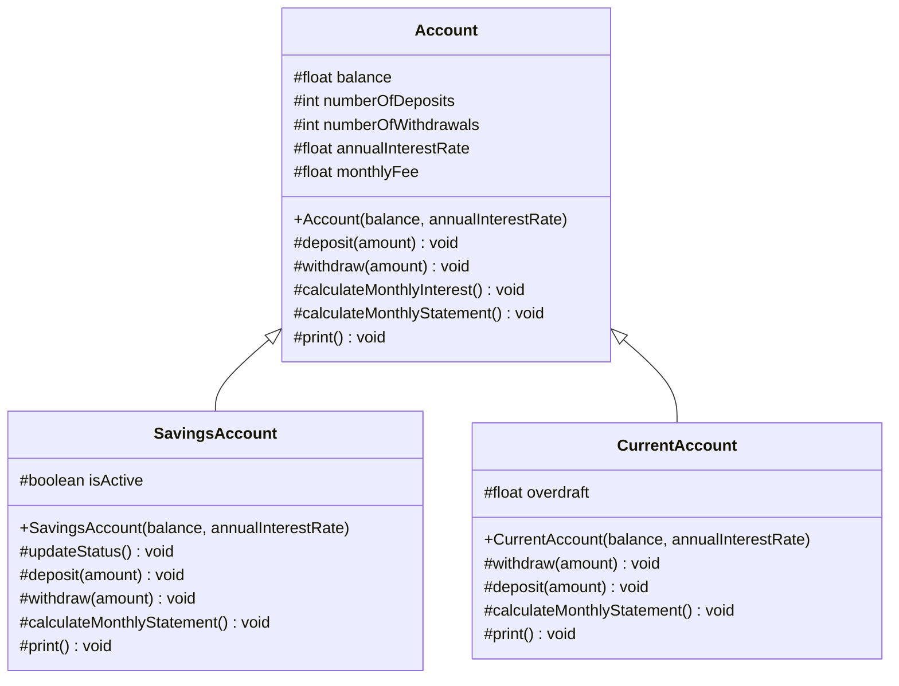
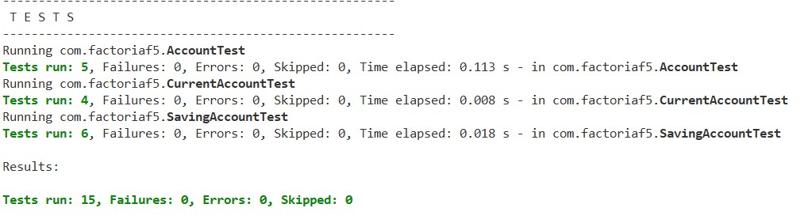
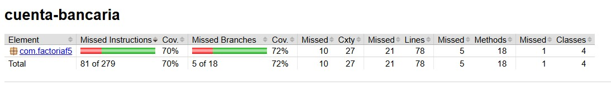

# Cuenta Bancaria

## Descripción del ejercicio

Este ejercicio forma parte del bootcamp de Factoria F5 y tiene como objetivo practicar los conceptos de Programación Orientada a Objetos en Java.

Se debe desarrollar un programa que modele una cuenta bancaria que tiene los siguientes atributos protegidos:

- saldo: tipo float
- numero consignaciones: tipo int, inicializado en 0
- numero retiros: tipo int, inicializado en 0
- tasa anual(porcentaje): tipo float
- comisionMensual: tipo float, inicializado en 0

Debe incluir un constructor que inicialice:

- el saldo
- la tasa anual

Y los siguientes métodos:

- consignar(): agregar dinero a la cuenta y actualizar el saldo
- retirar(): retirar dinero siempre que no supere el saldo
- calcular interes mensual(): calcular el interés mensual y actualizar el saldo
- extracto mensual(): restar la comisión mensual y calcular el interés mensual
- imprimir(): mostrar los valores de los atributos

## La clase Cuenta tiene dos clases hijas:

### Clase hija: Cuenta de ahorros
La clase Cuenta Ahorros debe tener un atributo booleano que indique si la cuenta está activa.

Reglas:

- Si el saldo es menor a 10000, la cuenta está inactiva
- Si el saldo es mayor o igual a 10000, la cuenta está activa

Métodos a redefinir:

- consignar(): solo permite consignar si la cuenta está activa
- retirar(): solo permite retirar si la cuenta está activa
- extractoMensual(): si el número de retiros es mayor que 4, se cobra una comisión adicional de 1000 por cada retiro extra
- imprimir(): mostrar saldo, comisión mensual y número total de transacciones

### Clase hija: Cuenta corriente
La clase CuentaCorriente debe tener un atributo sobregiro inicializado en 0.

Métodos a redefinir:

- retirar(): permite retirar más de lo disponible, dejando el exceso como sobregiro
- consignar(): invoca al método heredado y reduce el sobregiro si existe
- extractoMensual(): invoca al método heredado
- imprimir(): mostrar saldo, comisión mensual, número total de transacciones y sobregiro

## Entregables

### Diagrama UML de clases

#### Pruebas unitarias

#### Cobertura de tests

